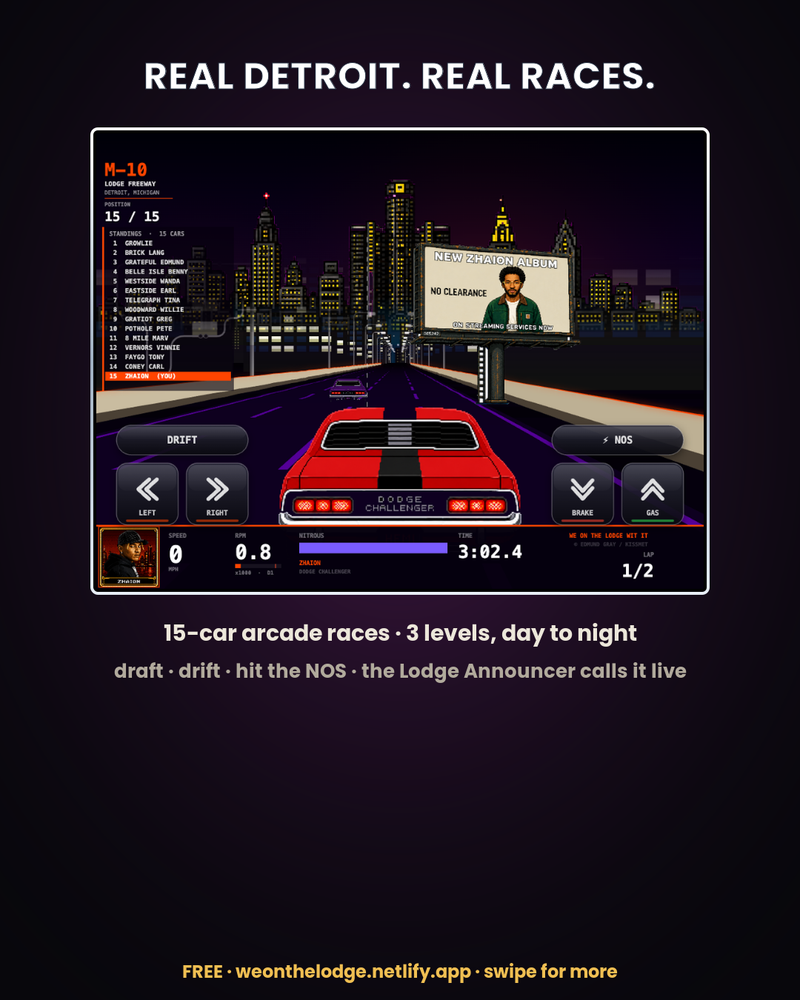
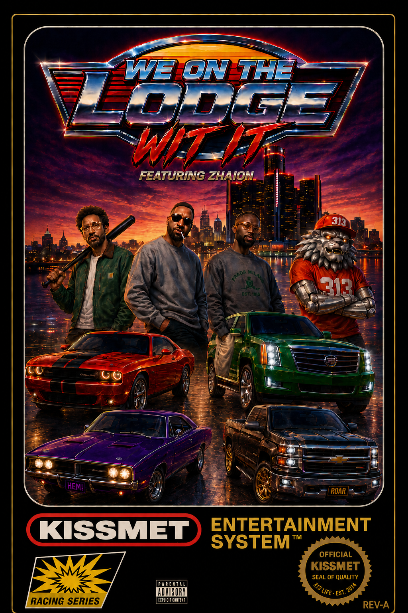

# 🏁 We On The Lodge Wit It

**An NES-style, pseudo-3D street-racing game set on Detroit's Lodge Freeway — designed, built, and shipped solo as a music-album launch vehicle.**

▶ **Play it live:** https://weonthelodge.netlify.app

A browser game (HTML5 Canvas + vanilla JavaScript, no framework) with a full three-level Detroit trilogy — the Lodge Freeway, Belle Isle, and a golden-hour Downtown finale that shifts day-to-night — four playable drivers with real cars, top-10 leaderboards, and free instant play with full mobile, multi-touch, and add-to-home-screen fullscreen support.

## Engineering highlights

- **Single-file game.** The entire game — rendering, game loop, HUD, level theming, the driver/car system, audio wiring, and UI — lives in one ~240 KB `index.html`. No build step, no dependencies.
- **Extended an open-source racing engine through a non-invasive overlay.** Custom UI/HUD, real-car sprite rendering, per-level Detroit theming, and collision/bumper physics — holding core-engine edits to three lines for long-term maintainability.
- **Debugged the engine from its source.** Diagnosed and fixed race-breaking bugs by reading the engine internals, then added a runtime difficulty-tuning layer that keeps every race winnable and close.
- **End-to-end AI content pipeline.** DALL·E pixel art and a painted NES-style box cover, per-driver cinematic intros and a "King of Detroit" outro animated in Seedance, and an ElevenLabs "Lodge Announcer" calling the race live over an original per-driver soundtrack.
- **Mobile-first PWA.** `apple-mobile-web-app` meta + a web manifest enable fullscreen add-to-home-screen play, with multi-touch controls.

## Tech

HTML5 Canvas · vanilla JavaScript · Web Audio API · Speech Synthesis API · PWA manifest · Netlify
AI tooling: DALL·E · Seedance · ElevenLabs

## The box art

## What's in this repo

- `index.html` — the complete game (engine integration, rendering, game loop, UI, audio wiring).
- `engine.min.js` — the base pseudo-3D racing engine (open-source), extended via the overlay above.
- `manifest.json` — PWA manifest.

> **A note on assets:** the game's audio, video, and art (~150 MB of AI-generated media) ship with the live build at the link above and are intentionally excluded from this repo to keep it lightweight and readable. The code here is the engineering showcase — to play the full game with media, use the live demo.

---

Built by **Edmund Gray** (Kissmet Music Group) — launching September 2026 with Zhaion's *NO CLEARANCE* album.
